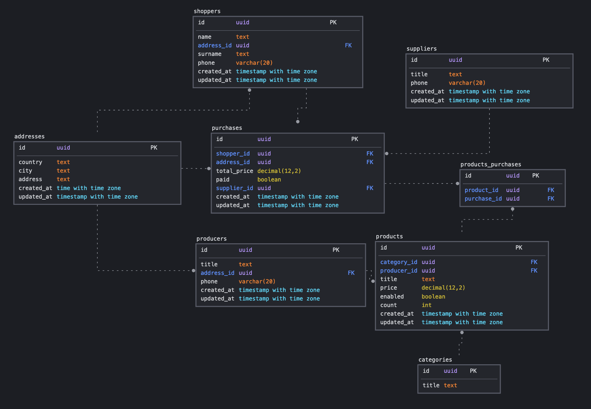

# Домашнее задание - Доработка проекта

## Цель

Спроектировать свою первую базу данных на курсе.

Реализуйте сущности продукты, категории продуктов, цены, поставщики, производители, покупатели и покупки.

Свои решения для этой схемы приветствуются

### В проекте должны быть

- [x] схема
- [x] документация
- [ ] примеры бизнес-задач которые решает база
- [ ] рекомендации к использованию репликации
- [ ] рекомендации к резервному копированию

---

## Результат

### Схема

### Документация

#### Таблицы

- shoppers - Покупатели
  - id - Уникальный идентификатор, форматом UUID
  - shopper_address_id - Ссылка на аддресс покупателя
  - name - Имя покупателя
  - surname - Фамилия покупателя
  - phone - Телефон покупателя
  - created_at - Дата создания
  - updated_at - Дата создания или изменения
- purchases - Покупки
  - id - Уникальный идентификатор, форматом UUID
  - shopper_id - Ссылка на Покупателей
  - address_id - Ссылка на Адресс куда нажно доставить продукт
  - supplier_id - Ссылка на поставщика, который отвезёт продукты
  - total_price - Цена за все продукты
  - paid - булевое значение, заплачено или нет
  - created_at - Дата создания
  - updated_at - Дата создания или изменения
- suppliers - Поставщики
  - id - Уникальный идентификатор, форматом UUID
  - title - Название компании, которая поставляет
  - phone - Телефон доставщика
  - created_at - Дата создания
  - updated_at - Дата создания или изменения
- products_purchases - Таблица которая говорит какие покупки, к каким продуктам относится
  - id - Уникальный идентификатор, форматом UUID
  - product_id - Ссылка на Продукт
  - purchase_id - Ссылка на Покупку
- products - Продукты
  - id - Уникальный идентификатор, форматом UUID
  - category_id - Ссылка на котегорию продукта
  - producer_id - Ссылка на Производителя продукта
  - created_at - Дата создания
  - updated_at - Дата создания или изменения
- categories - Категории продуктов
  - id - Уникальный идентификатор, форматом UUID
  - title - Название категории
- producers - Производители
  - id - Уникальный идентификатор, форматом UUID
  - address_id - Ссылка на аддресс производителя
  - phone - Телефон производителя
  - created_at - Дата создания
  - updated_at - Дата создания или изменения
- addresses (Аддреса)
  - id - Уникальный идентификатор, форматом UUID
  - country - Странна
  - city - Город
  - address - Адресс
  - created_at - Дата создания
  - updated_at - Дата создания или изменения

### Бизнес задача

Данная схема поможет в управлении интернет магазина следующем:

1. Таблица **addresses**, нам поможет в сохранение адресса клиента, аддресс производителя, и куда был доставлен продукт, при какой нибудь доставки
2. Хранение информации об покупателях, производителях и поставщиках: названия, их телефоны.
3. Благодаря категориям продуктов, можно фильтровать категории по типам.
4. Мы можем сохранить информацию о покупки, и анализировать в каком месяце было больше покупок, кто купил.
