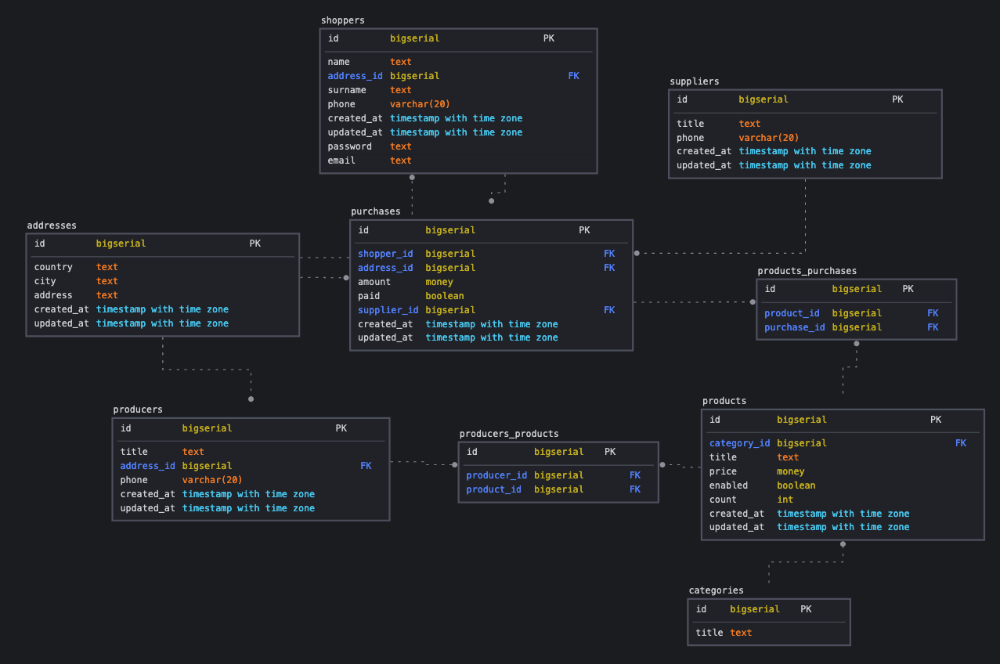

# Домашнее задание - Доработка проекта

## Цель

Спроектировать свою первую базу данных на курсе.

Реализуйте сущности продукты, категории продуктов, цены, поставщики, производители, покупатели и покупки.

Свои решения для этой схемы приветствуются

### В проекте должны быть

- схема
- документация
- примеры бизнес-задач которые решает база
- рекомендации к использованию репликации
- рекомендации к резервному копированию

---

## Результат

### Схема

### Документация

---

Основные таблицы

- shoppers - Покупатели
  - id - Уникальный идентификатор, форматом UUID
  - shopper_address_id - Ссылка на аддресс покупателя
  - name - Имя покупателя
  - surname - Фамилия покупателя
  - phone - Телефон покупателя
  - created_at - Дата создания
  - updated_at - Дата создания или изменения
- purchases
  - id - Уникальный идентификатор, форматом UUID
- suppliers
  - id - Уникальный идентификатор, форматом UUID
- products_purchases
  - id - Уникальный идентификатор, форматом UUID
- products
  - id - Уникальный идентификатор, форматом UUID
- categories
  - id - Уникальный идентификатор, форматом UUID
- producers
  - id - Уникальный идентификатор, форматом UUID

---

Следующие таблицы это аддреса, для других таблиц:

- shopper_addresses (для таблицы shoppers)
- purchase_addresses (для таблицы purchases)
- producer_addresses (для таблицы pruducers)

Эти таблицы содержат

- id - Уникальный идентификатор, форматом UUID
- country - Странна
- city - Город
- address - Адресс
- created_at - Дата создания
- updated_at - Дата создания или изменения
