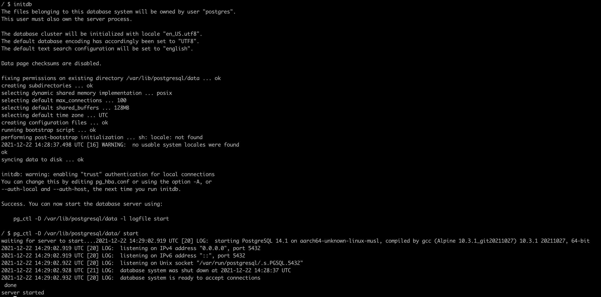

# Домашнее задание - Установка СУБД PostgreSQL

## Цель

Создать кластер PostgreSQL в докере или на виртуальной машине, запустить сервер и подключить клиента

## Задачи

### 1. Развернуть контейнер с PostgreSQL или установить СУБД на виртуальную машину


```bash
docker run -e POSTGRES_PASSWORD=postgres -it postgres:14-alpine sh
```

### 2. Запустить сервер



```bash
initdb
pg_ctl -D /var/lib/postgresql/data/ start
```

---

Первые 2 шага можно было пропустить с помощью команды

```bash
docker run -e POSTGRES_PASSWORD=postgres -d postgres:14-alpine
```

### 3. Создать клиента с подключением к базе данных postgres через командную строку

### 4. Подключиться к серверу используя pgAdmin или другое аналогичное приложение
