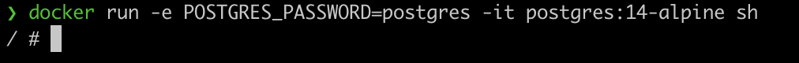
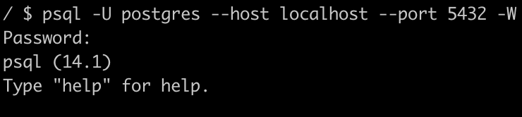
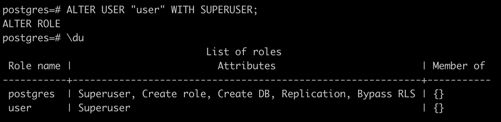
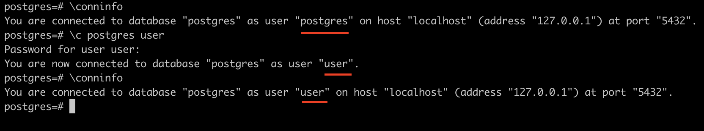
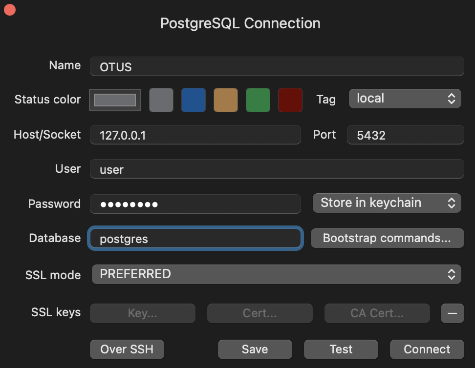
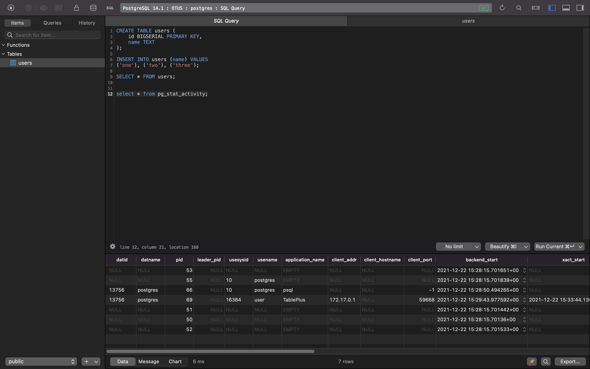

# Установка СУБД PostgreSQL

## Цель

Создать кластер PostgreSQL в докере или на виртуальной машине, запустить сервер
и подключить клиента

## Задачи

### 1. Развернуть контейнер с PostgreSQL или установить СУБД на виртуальную машину



```bash
docker run -e POSTGRES_PASSWORD=postgres -it postgres:14-alpine sh
```

### 2. Запустить сервер


```bash
initdb
pg_ctl -D /var/lib/postgresql/data/ start
```

---

Первые 2 шага можно было пропустить с помощью команды

```bash
docker run -e POSTGRES_PASSWORD=postgres -d postgres:14-alpine
```

### 3. Создать клиента с подключением к базе данных postgres через командную строку






```bash
psql -U postgres --host localhost --port 5432 -W
CREATE USER "user" WITH ENCRYPTED PASSWORD 'password';
ALTER USER "user" WITH SUPERUSER;

\conninfo
\c postgres user
\conninfo
```

### 4. Подключиться к серверу используя pgAdmin или другое аналогичное приложение

Для выполнения этого пункта я использовал приложение [TablePlus](https://tableplus.com/)



